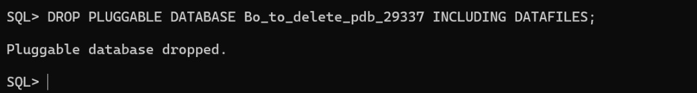
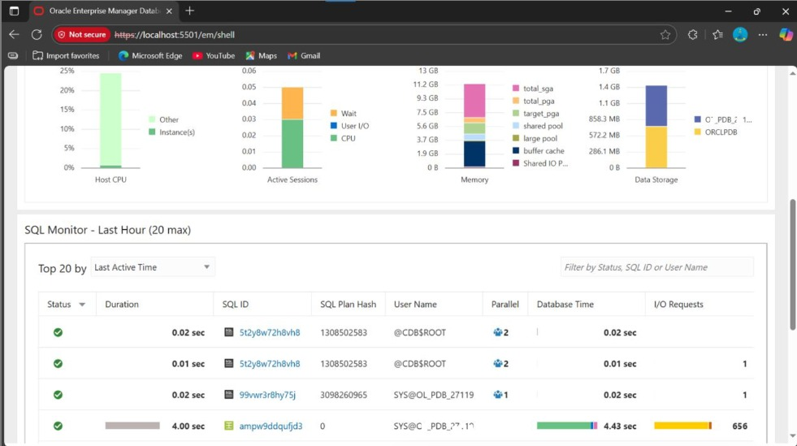

# 📘 Assignment II: Database Creation, Deletion & OEM

## NAME: MWUNGERI Bohneur

## ID: 29337

## 🧩 Overview

This assignment involves creating and deleting **Pluggable Databases (PDBs)** in Oracle, and configuring **Oracle Enterprise Manager (OEM)**.  


---

## ⚙️ Task 1: Create a New Pluggable Database (PDB)


```SQL

CREATE PLUGGABLE DATABASE Bo_to_delete_pdb_29337
ADMIN USER Bohneur_27337 IDENTIFIED BY "Boh123"
FILE_NAME_CONVERT = (
  'D:\ORACLE21C\ORADATA\ORCL\PDBSEED\',
  'D:\ORACLE21C\ORADATA\ORCL\BO_TO_DELETE_PDB_29337\'
);

```
   


    


## 🗑️ Task 2: Create and Delete Another PDB
 

##  Creation

```SQL

CREATE PLUGGABLE DATABASE TO_DELETE_PDB_29337
ADMIN USER Bohneur IDENTIFIED BY "Boh123"
FILE_NAME_CONVERT = (
  'D:\ORACLE21C\ORADATA\ORCL\PDBSEED\',
  'D:\ORACLE21C\ORADATA\ORCL\TO_DELETE_PDB_29337\'
);

```


 ## Deletion

```sql

 DROP PLUGGABLE DATABASE TO_DELETE_PDB_29337 INCLUDING DATAFILES;

 ```
   


## 🧭 Task 3: Oracle Enterprise Manager (OEM)

1. Open and configure **Oracle Enterprise Manager**.


